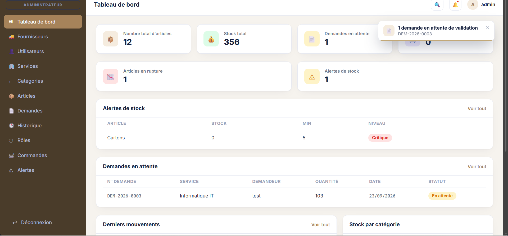
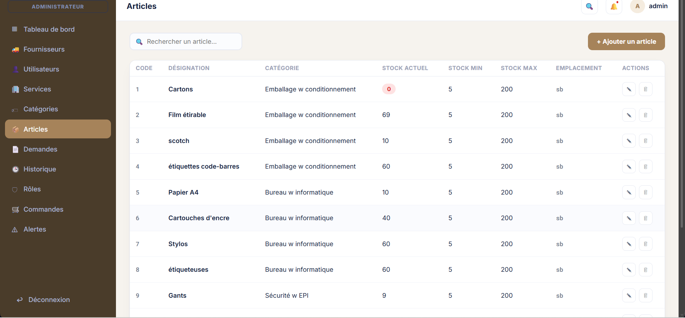
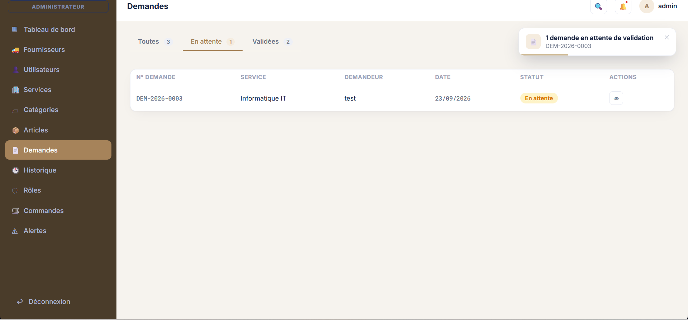
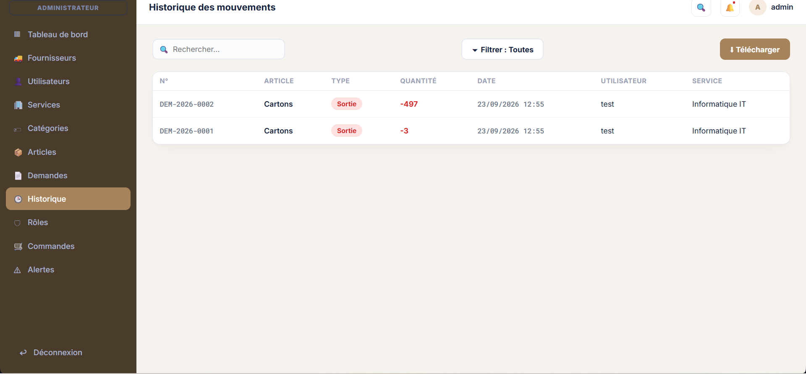

<div align="center">

# 📦 StockPilot

**Application web de gestion de stock — PHP · MySQL · JavaScript**

Projet réalisé dans le cadre de mon stage PFA chez **Vectorys Logistics**


</div>

---

## 📑 Sommaire

- [À propos](#-à-propos)
- [Aperçu](#️-aperçu)
- [Services & rôles](#-services--rôles)
- [Fonctionnalités détaillées](#️-fonctionnalités-détaillées)
- [Stack technique](#️-stack-technique)
- [Architecture & structure du projet](#-architecture--structure-du-projet)
- [Modèle de données](#-modèle-de-données)
- [Installation](#-installation-locale)
- [Sécurité](#-sécurité)
- [Améliorations futures](#-améliorations-futures)
- [Auteur](#-auteur)

---

## 📖 À propos

**StockPilot** est une application web développée pour gérer le stock de consommables d'une entreprise. Le projet couvre l'ensemble du cycle de gestion : articles, fournisseurs, demandes internes, commandes et historique des mouvements.

Le développement a commencé comme une base simple de gestion de stock, puis a évolué progressivement vers un système plus complet avec :
- une gestion des rôles et des permissions,
- une validation automatique des demandes selon la disponibilité du stock,
- un système d'alertes sur les seuils critiques,
- l'export de l'historique en plusieurs formats.

Ce projet a été réalisé en autonomie, de la conception de la base de données jusqu'à l'interface finale.

---

## 🖼️ Aperçu

| Tableau de bord | Gestion des articles |
|:---:|:---:|
|  |  |

| Gestion des demandes | Historique des mouvements |
|:---:|:---:|
|  |  |

---

## 🏢 Services & rôles

L'application repose sur une séparation claire entre les **services** (départements) de l'entreprise et les **rôles** qui y sont rattachés.

| Rôle | Accès | Responsabilités |
|---|---|---|
| 👑 **Administrateur** | Total | Gestion des utilisateurs, des rôles, des plafonds de stock, accès à tous les modules |
| 🛒 **Responsable Achats** | Étendu | Gestion des articles, fournisseurs et commandes, suivi du réapprovisionnement |
| 🏭 **Responsable Service** | Restreint | Création de demandes de consommables pour son service, suivi de leur statut |

**Cycle de vie d'une demande :**

---

## ⚙️ Fonctionnalités détaillées

### 📦 Articles
- Ajout, modification, suppression (CRUD complet)
- Classement par catégories
- Seuils de stock **min / max** configurables par article
- Détection automatique des articles en rupture ou sous le seuil

### 🚚 Fournisseurs
- Gestion des fiches fournisseurs liées aux commandes
- Historique des commandes par fournisseur

### 📋 Demandes
- Création de demandes multi-articles par service
- **Validation automatique** dès que le stock redevient suffisant
- Gestion des **demandes partielles** (fulfillment partiel en cas de sur-demande)
- Statuts : *en attente* / *validée*

### 🕓 Historique
- Traçabilité complète de tous les mouvements de stock (entrées/sorties)
- Filtres par type, date, service
- **Export PDF / Word / Excel**

### 🔔 Alertes
- Notifications automatiques sur les articles en stock critique ou bas
- Tableau de bord centralisant les alertes actives

### 🔐 Authentification
- Connexion par session PHP
- Contrôle d'accès basé sur les rôles (RBAC)
- Récupération de mot de passe par email (SMTP)

---

## 🛠️ Stack technique

| Composant | Technologie |
|---|---|
| Langage backend | PHP |
| Base de données | MySQL |
| Accès données | PDO (requêtes préparées) |
| Frontend | JavaScript, HTML, CSS |
| Serveur | Apache (XAMPP) |
| Emails | SMTP (Gmail) |

---

## 🏗️ Architecture & structure du projet

L'application suit une architecture simple **API REST maison + SPA** : le frontend (`index.html` + JS) communique avec les endpoints PHP sous `api/` via des requêtes JSON.

---

## 🗄️ Modèle de données

Tables principales de la base `stockpilot` :

| Table | Rôle |
|---|---|
| `utilisateurs` | Comptes, rôles, services |
| `articles` | Catalogue des consommables, seuils min/max |
| `fournisseurs` | Fiches fournisseurs |
| `demandes` / `demande_lignes` | Demandes internes et leurs lignes d'articles |
| `commandes` | Commandes passées aux fournisseurs |
| `historique` | Journal de tous les mouvements de stock |
| `alertes_historique` | Historique des alertes de stock déclenchées |
| `services` / `categories` | Référentiels internes |

---

## 🚀 Installation locale

1. **Cloner le repo** dans le dossier `htdocs/` de XAMPP :
```bash
   git clone https://github.com/<ton-user>/stockpilot-xampp.git
```

2. **Démarrer Apache et MySQL** depuis le panneau de contrôle XAMPP

3. **Importer la base de données** :
   - Ouvrir phpMyAdmin
   - Créer une base nommée `stockpilot`
   - Importer le fichier `database.sql`

4. **Configurer `config.php`** :
   - Renseigner les identifiants de connexion à la base
   - (Optionnel) configurer les identifiants SMTP pour la récupération de mot de passe

5. **Accéder à l'application** :
